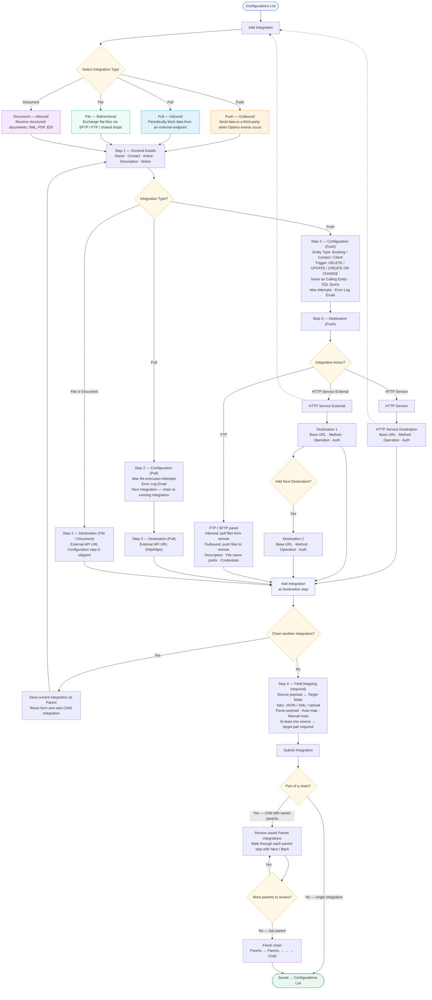

# Integration Configuration Flow

End-to-end flow for **Integration Builder Pro** (as built today).  
Covers all four integration types, wizard steps, destination options, required field mapping, and integration chaining.

## Wizard steps by type

| Type | Steps | Flow |
|------|-------|------|
| **Push** | 4 | General Details → Configuration → Destination → Field Mapping |
| **Pull** | 4 | General Details → Configuration → Destination → Field Mapping |
| **File** | 3 | General Details → Destination → Field Mapping |
| **Document** | 3 | General Details → Destination → Field Mapping |

## Integration types

| Type | Data direction | Configuration | Destination options |
|------|----------------|---------------|---------------------|
| **Push** | Optimo → external system | Entity, trigger, SQL query, error email | HTTP Service, HTTP Service External, FTP |
| **Pull** | External system → Optimo | Max attempts, error email, next integration | External API URL |
| **File** | Bidirectional file exchange | *(skipped)* | External API URL |
| **Document** | External → Optimo (documents) | *(skipped)* | External API URL |

## Notes

- **Field mapping is required** — submit is blocked until at least one source → target mapping exists.
- **HTTP Service** — select action → configure **HTTP Service Destination** (single panel) → *Add Integration* to chain or continue to mapping.
- **HTTP Service External** — can go directly to *Add Integration*; optionally configure Destination 1 and/or Destination 2 via *Add Next Destination* (up to 2 HTTP panels).
- **Integration chaining** — *Add Integration* at the Destination step saves the current form as a parent and starts a new child integration. Submitting the child triggers a parent review before the full chain is saved.
- **No test / simulation step** in the current wizard — integrations save directly after field mapping (or after parent-chain review).
