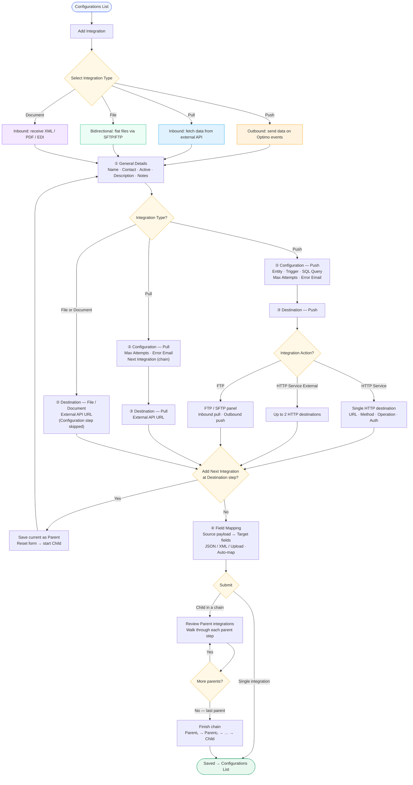

# Integration Flows

End-to-end flow for all integration types in Integration Builder Pro — from entry through type-specific setup, destinations, chaining, mapping, and submission.

## Integration types

| Type | Direction | Config step | Destination |
|------|-----------|-------------|-------------|
| **Push** | Optimo → external | Entity, trigger, SQL query | HTTP Service, HTTP External, or FTP |
| **Pull** | External → Optimo | Max attempts, next integration | External API URL |
| **File** | Bidirectional files | Skipped | External API URL |
| **Document** | External → Optimo | Skipped | External API URL |
